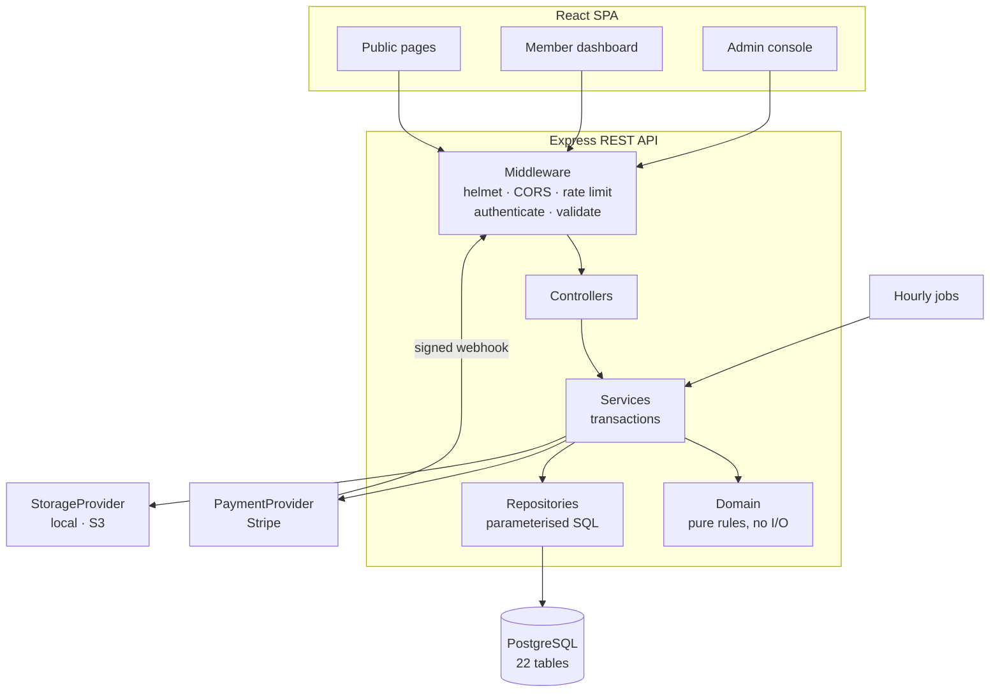

# Digital Heroes

**Play → Perform → Give back → Win.**

A subscription platform for golfers. Members log their rolling Stableford
scores, direct a share of every payment to a charity they choose, and enter a
monthly prize draw where their scores become their ticket. Administrators run
the draw, verify winning claims against uploaded proof, and record payouts.

This is a complete, working full-stack build: React client, Express/PostgreSQL
API, Stripe payments behind a swappable provider, object storage for proof
images, migrations, seed data, tests and documentation.

---

## Contents

1. [What it does](#what-it-does)
2. [Architecture](#architecture)
3. [Tech stack](#tech-stack)
4. [Quick start](#quick-start)
5. [Test credentials](#test-credentials)
6. [Project structure](#project-structure)
7. [Business rules](#business-rules)
8. [The draw engine](#the-draw-engine)
9. [Winner verification](#winner-verification)
10. [API](#api)
11. [Environment variables](#environment-variables)
12. [Scripts](#scripts)
13. [Testing](#testing)
14. [Security](#security)
15. [Design](#design)
16. [Documentation](#documentation)
17. [Requirement checklist](#requirement-checklist)

---

## What it does

**For members**

- Subscribe monthly or yearly through Stripe.
- Choose a charity and set the share of every payment it receives — minimum
  10%, maximum 100%.
- Log Stableford scores (1–45 points, one per date). The five most recent are
  retained; a sixth pushes the oldest off.
- Receive a five-number ticket for the monthly draw, derived from those scores.
- Match three, four or five numbers to take a share of the pool.
- Upload a screenshot as proof of a win and follow the claim through to payment.
- Donate to any charity directly, with or without a membership.

**For administrators**

- Review accounts, subscriptions and scores; correct or remove a score with the
  change written to the audit log.
- Manage the charity directory and its events.
- Create, configure, **simulate** and publish the monthly draw.
- Verify proof of score, approve or reject claims, and record payouts.
- Read platform reporting drawn entirely from SQL aggregates.

---

## Architecture



The domain layer has no imports from the database, HTTP or the environment.
That is what lets the business rules be tested without a database running, and
it is why the same rule can be enforced identically from a route, a job and a
script.

---

## Tech stack

| Layer | Choice |
| --- | --- |
| Client | React 18, Vite, React Router 6, Tailwind CSS, Framer Motion, Recharts |
| API | Node 20, Express 4, Zod validation, JWT (httpOnly cookie), bcrypt |
| Database | PostgreSQL 14+ — foreign keys, check constraints, partial unique indexes, triggers |
| Payments | Stripe, behind a `PaymentProvider` interface |
| Storage | Local disk or any S3-compatible bucket, behind a `StorageProvider` interface |
| Tests | `node --test` with supertest |

---

## Quick start

**Prerequisites:** Node 20+, PostgreSQL 14+.

```bash
# 1. Database
createdb digital_heroes

# 2. API
cd server
cp .env.example .env          # set DATABASE_URL and JWT_SECRET
npm install
npm run migrate
npm run seed
npm run dev                   # http://localhost:4000

# 3. Client (second terminal)
cd client
cp .env.example .env
npm install
npm run dev                   # http://localhost:5173
```

The client dev server proxies `/api` to `http://localhost:4000`, so both halves
share an origin and the session cookie behaves as it will in production.

To exercise payments, add your Stripe test keys to `server/.env` and run
`npm run stripe:listen` in a third terminal. Without them the app still runs —
everything except checkout works, and the seeded subscriptions are already
active.

---

## Test credentials

Every seeded account uses the password **`DigitalHeroes2026!`**

| Role | Email | What it demonstrates |
| --- | --- | --- |
| Administrator | `admin@digitalheroes.test` | Full console, draw controls, verification queue |
| Member (active) | `amara.okafor@example.test` | Full five scores, charity selected, past wins |
| Member (active) | `tom.whitlock@example.test` | Partial score history, a claim mid-verification |
| Lapsed member | `wren.halloway@example.test` | Past-due state — read access, score entry blocked |
| Cancelled member | `louis.aberdeen@example.test` | Cancelled membership with history intact |

The seed also creates two published draws — the first rolls its unclaimed
jackpot into the second — and one open draw ready to simulate, so the draw
controls have something real to work on immediately.

---

## Project structure

```
digital-heroes/
├── client/
│   └── src/
│       ├── components/
│       │   ├── charts/        Recharts wrappers fed by /api/admin/reports
│       │   ├── layout/        Public, dashboard and admin shells, route guards
│       │   └── ui/            Button, Panel, Form, Modal, Stat, Countdown, DataTable…
│       ├── context/           AuthContext, ToastContext
│       ├── lib/               api client, formatters, useAsync
│       └── pages/
│           ├── public/        Home, HowItWorks, Charities, CharityProfile, Draws, Pricing, Login, Register
│           ├── dashboard/     Overview, Scores, Charity, Subscription, Winnings, Profile
│           └── admin/         Overview, Users, Subscriptions, Scores, Draws, DrawDetail, Charities, Winners, Reports
├── server/
│   ├── migrations/            001_init.sql + down migration
│   ├── seed/                  Charities and full demo dataset
│   ├── src/
│   │   ├── domain/            scores · draw · charity · winners · subscriptions  (pure)
│   │   ├── repositories/      All SQL lives here
│   │   ├── services/          Orchestration and transactions
│   │   ├── controllers/       Thin
│   │   ├── routes/            59 endpoints
│   │   ├── middleware/        authenticate, validate, errorHandler, rateLimit, upload
│   │   ├── integrations/      payments/ and storage/ providers
│   │   ├── jobs/              Hourly scheduler
│   │   └── db/                pool, transactions, migration runner
│   └── tests/                 66 tests
└── docs/                      architecture · database-schema · api-documentation · deployment
```

---

## Business rules

Rules that matter are enforced in more than one place, and never only in the
browser.

**Scores**

- 1–45 Stableford points — validated by Zod, constrained by `CHECK`.
- One score per member per date — `UNIQUE (user_id, played_on)`.
- Five retained. Adding a sixth evicts the oldest inside a transaction that
  locks the member's rows with `FOR UPDATE`.
- Displayed newest first.

**Charity**

- Minimum 10%, maximum 100% of the subscription — asserted in the domain layer,
  validated by Zod, and constrained by `CHECK (charity_percent BETWEEN 10 AND 100)`.
- Direct donations are a separate flow with no effect on draw entry, open to
  signed-out visitors.

**Prize pool**

- Calculated from live subscription revenue every time, never hard-coded.
- Allocated 40% to the five-match tier, 35% to four, 25% to three.
- The five-match jackpot rolls over if unclaimed. The four and three tiers do
  not roll over.
- A tier is split equally between its winners; leftover pence are distributed
  one at a time so the parts always sum exactly to the whole.

All money is stored and moved as integer minor units. No floating-point
arithmetic touches a stored amount.

---

## The draw engine

```
DrawEngine
  ├── RandomStrategy | WeightedScoreStrategy   picks five numbers from forty
  ├── MatchEvaluator                           buckets entries by match count
  └── PrizeCalculator                          allocates 40/35/25, handles rollover
```

The engine returns a plain object and writes nothing. What happens to that
object is the difference between the two operations:

| | Simulate | Publish |
| --- | --- | --- |
| Writes | `draw_simulations` only | results, tiers, winners, rollover |
| Repeatable | Yes, as often as you like | No — once |
| Visible to members | No | Yes |
| Transactional | — | One transaction, all or nothing |

Both use a seeded generator. The admin UI publishes with the seed from the
simulation being reviewed, so the outcome committed is exactly the outcome that
was inspected.

`WeightedScoreStrategy` biases the ball selection by member score frequency but
keeps a baseline weight on every ball, so no number can become unreachable.

---

## Winner verification

```
PENDING_PROOF → PROOF_SUBMITTED → UNDER_REVIEW → APPROVED → PAYOUT_PENDING → PAID
                       ↑                  │
                       └──── REJECTED ────┘
```

A member uploads a screenshot; the bytes go to object storage and the database
keeps only the key and a checksum. An administrator opens it through a
15-minute signed URL, then approves or rejects with a note the member can read.
A rejected proof is retained and superseded rather than deleted, so a disputed
claim keeps its history.

The transition table is the single source of truth. Any move not in it is
rejected with a 409, whatever the client sends.

---

## API

59 REST endpoints under `/api`. Every response uses the same envelope:

```json
{ "success": true, "data": { }, "message": "Score saved." }
```

Validation failures return per-field errors so forms can show them inline.
Full reference: [`docs/api-documentation.md`](docs/api-documentation.md).

---

## Environment variables

See `server/.env.example` and `client/.env.example` for the annotated lists.
The server reads `process.env` in exactly one file — `src/config/env.js` — and
in production a missing required variable throws at boot.

Anything in `client/.env` ships to the browser, so nothing secret belongs there.

---

## Scripts

**Server**

| Command | Does |
| --- | --- |
| `npm run dev` | Start with file watching |
| `npm start` | Start for production |
| `npm run migrate` / `migrate:down` | Apply / roll back migrations |
| `npm run seed` | Load the demo dataset |
| `npm run db:reset` | Drop, migrate and re-seed |
| `npm test` | Full suite |
| `npm run test:domain` | Domain rules only — no database needed |
| `npm run stripe:listen` | Forward Stripe webhooks locally |

**Client**

| Command | Does |
| --- | --- |
| `npm run dev` | Dev server with `/api` proxy |
| `npm run build` | Production bundle to `dist/` |
| `npm run preview` | Serve the built bundle |

---

## Testing

```bash
cd server && npm test
```

66 tests, all passing. They cover:

- **Score rules** — range, one-per-date, rolling eviction, ordering, summaries.
- **Charity** — the 10–100% band, contribution splitting, annualised impact.
- **Draw** — tier allocation summing exactly to the pool, equal splits with
  remainder handling, jackpot rollover, lower tiers not rolling over, seeded
  reproducibility.
- **Winners** — every legal transition, and rejection of every illegal one.
- **Subscriptions** — entitlement derivation, provider status mapping.
- **Authorization** — 401 without a session, forged tokens rejected, the admin
  role gate, structured 404s, 422 with field errors, unsigned webhooks refused,
  and no stack traces or SQL in any error response.

The domain tests need no database, which is the practical benefit of keeping
that layer free of I/O.

---

## Security

- Passwords hashed with bcrypt at 12 rounds. Login compares against a dummy
  hash when the account does not exist, so response time does not reveal
  whether an email is registered.
- JWT in an httpOnly, SameSite=Lax cookie — unreadable from JavaScript. Bearer
  tokens are also accepted for non-browser clients.
- Role and subscription entitlement re-derived from the database on every
  request, never trusted from the token.
- Every query parameterised. No string-built SQL anywhere.
- Zod validation at the boundary; controllers never see unvalidated input.
- Rate limiting, tightest on authentication.
- Helmet headers; CORS as an explicit allowlist.
- Webhooks signature-verified and made idempotent by a unique constraint on
  `(provider, event_id)`.
- Uploads restricted by MIME type and size, held in memory only long enough to
  hand to storage, and served through expiring signed URLs.
- Error responses carry a message and a code — never a stack trace, a SQL
  fragment or an internal path.
- Administrative actions written to `audit_logs` with actor, entity and time.

---

## Design

The interface is built from a deliberate set of tokens rather than framework
defaults: near-black ink surfaces, warm ivory text, and three accents that
carry meaning — jade for charity, coral for action, gold for rewards. Type is
Sora for display and DM Sans for body.

Glassmorphism is used selectively, for things that genuinely float: navigation,
the prize pool panel, key metrics, modals. Dense content sits on solid surfaces
so the hierarchy survives. Motion is opt-in per element rather than applied to
every section, and the whole system honours `prefers-reduced-motion`.

The member dashboard uses a left rail on desktop and a bottom navigation bar on
phones, because that is where a thumb is. Admin tables restack into labelled
cards on narrow screens instead of scrolling sideways. Every list has a
designed empty state that explains what belongs there and offers the action
that fills it.

---

## Documentation

| Document | Covers |
| --- | --- |
| [`docs/architecture.md`](docs/architecture.md) | Layers, request lifecycle, where each rule is enforced, integrations |
| [`docs/database-schema.md`](docs/database-schema.md) | Every table, constraint and index, with an ER diagram |
| [`docs/api-documentation.md`](docs/api-documentation.md) | All 59 endpoints, envelope, status codes, auth, webhooks |
| [`docs/deployment.md`](docs/deployment.md) | Environment, migrations, Stripe webhook, storage, pre-launch checklist |

---

## Requirement checklist

Working and verified:

| Requirement | Status |
| --- | --- |
| React + Vite + React Router + Tailwind + Framer Motion client | Built, production bundle verified |
| Node + Express REST API, 59 endpoints | Routes enumerate and respond |
| JWT auth, bcrypt, role-based access control | Covered by the authorization tests |
| PostgreSQL with FKs, constraints, indexes, transactions | 22 tables in one migration, with a down migration |
| Migrations and seed data | `migrate`, `migrate:down`, `db:reset`, `seed` |
| Stableford 1–45, one per date, rolling five | Enforced in domain, service and schema; tested |
| Charity 10–100% plus independent donations | Enforced in three layers; tested |
| Prize pool auto-calculated, 40/35/25, jackpot rollover | Tested including remainder handling |
| Random and score-weighted draw strategies | Both implemented, seeded and reproducible |
| Simulation that commits nothing; publish in one transaction | Separate code paths; simulation writes only to `draw_simulations` |
| Winner state machine with proof upload and review | Full transition table; illegal moves rejected |
| Object storage for proofs, not the database | Local and S3 drivers; only keys stored |
| Payments behind a swappable provider | `PaymentProvider` interface with a Stripe driver |
| All public, member and admin pages | Every route in the brief is implemented |
| Admin reporting from database aggregates | Eight charts fed by SQL, no invented figures |
| Documentation set and README | This file plus four documents in `docs/` |
| Test suite | 66 tests, all passing |

Needs your own accounts or infrastructure — the code is in place but cannot be
verified in this build:

| Item | Why |
| --- | --- |
| Live Stripe checkout, portal and webhooks | Requires your Stripe test keys, price IDs and webhook secret. The provider abstraction and webhook handler are implemented and the unsigned-webhook rejection is tested, but no real payment has been processed |
| S3 storage driver | Implemented and selectable, but exercised only against the local driver here. `@aws-sdk/client-s3` is loaded lazily and must be installed when you switch |
| Deployment steps in `docs/deployment.md` | Written against the code, not executed against a live host |
| End-to-end browser tests | Not included. The API is covered by integration tests; the client has no automated test suite |
| Email notification of a win | Not implemented. Members see the claim in their dashboard instead |

Everything in the first table has been run. Nothing in it is aspirational.
