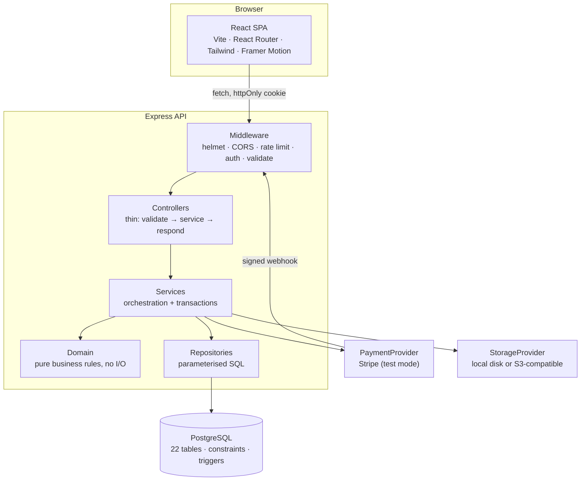

# Architecture

Digital Heroes is a two-tier application: a React single-page client and an
Express REST API over PostgreSQL. There is no server-side rendering and no
shared code between the two halves — the API is the only contract.

## System shape



## Layers, and why they are separate

**Domain (`server/src/domain/`)** holds the rules that define the product: the
rolling five-score rule, the 10–100% charity band, the 40/35/25 prize
allocation with its jackpot rollover, the winner state machine, and the draw
strategies. Nothing in this layer imports a database client, an HTTP object or
`process.env`. That is what makes the rules testable in isolation — the 66-test
suite exercises them directly, with no database running.

**Repositories (`server/src/repositories/`)** are the only place SQL is
written. Every query is parameterised. Each method takes an optional executor
argument so the same function works inside or outside a transaction.

**Services (`server/src/services/`)** orchestrate: they call domain functions to
decide what should happen, then call repositories to make it happen, wrapping
multi-step work in a transaction. Adding a score, publishing a draw and
submitting proof are all single transactions.

**Controllers and routes** are deliberately thin — parse, delegate, shape the
response. Validation happens in middleware from Zod schemas before a controller
runs, so a controller never sees unvalidated input.

## Request lifecycle

```mermaid
sequenceDiagram
  participant C as Client
  participant M as Middleware
  participant S as Service
  participant D as Domain
  participant P as Postgres

  C->>M: POST /api/scores { value, playedOn }
  M->>M: authenticate (cookie or bearer)
  M->>M: requireSubscription (re-derived per request)
  M->>M: validate against Zod schema
  M->>S: scoreService.add(userId, body)
  S->>P: BEGIN; SELECT ... FOR UPDATE
  S->>D: planScoreInsert({ existing, value, playedOn })
  D-->>S: { value, playedOn, evictIds }
  S->>P: DELETE evicted; INSERT new; COMMIT
  S-->>C: 201 { success, data: { score, evicted } }
```

The subscription check is re-derived from the stored record on every request
rather than trusted from the token. A member whose payment fails mid-session
loses score entry on their next request, not at their next login.

## Where each rule is enforced

A rule that matters is enforced more than once, and never only in the browser.

| Rule | Client | API | Database |
| --- | --- | --- | --- |
| Stableford 1–45 | input `min`/`max` | Zod schema | `CHECK (value BETWEEN 1 AND 45)` |
| One score per user per date | — | service error mapping | `UNIQUE (user_id, played_on)` |
| Five retained scores | shows which will drop | transactional eviction | — (invariant held by the service) |
| Charity share 10–100% | slider bounds | Zod + domain assert | `CHECK (charity_percent BETWEEN 10 AND 100)` |
| Admin-only routes | hidden links | `requireRole('admin')` | — |
| One live subscription per user | — | service guard | partial unique index |
| Winner state transitions | only allowed actions rendered | state machine | `CHECK` on state enum |

The client column is presentation. Deleting the client entirely would not
weaken any of these.

## Money

All amounts are integers in minor units (pence). No floating-point arithmetic
touches a stored amount. Tier allocation gives its remainder to the final tier
and equal splits distribute leftover pence one at a time, so the parts always
sum exactly to the whole. Conversion to a decimal happens once, in
`client/src/lib/format.js`.

## The draw, and why simulation is separate

`DrawEngine` composes a strategy (which picks the numbers), a `MatchEvaluator`
(which buckets entries) and a `PrizeCalculator` (which allocates the tiers). It
returns a plain object and writes nothing.

`drawService.simulate()` runs the engine and stores the result in
`draw_simulations` only. It can be run repeatedly and changes nothing a member
can see. `drawService.publish()` runs inside one transaction and writes
`draw_results`, `prize_tiers`, `winners` and the rollover onto the next draw.
Both use a seeded generator, so publishing with the seed from a simulation
reproduces that exact outcome — which is what the admin UI does.

## Swappable integrations

`PaymentProvider` and `StorageProvider` are interfaces with concrete drivers
behind a factory. The Stripe driver normalises provider events into internal
event names, so the webhook handler never branches on Stripe-specific shapes.
Storage has a local driver (HMAC-signed expiring URLs through `/api/files`) and
an S3 driver. Proof images are never stored in Postgres — only the object key.

## Background work

`server/src/jobs/scheduler.js` runs hourly: expire lapsed subscriptions,
recalculate the prize pool, ensure the next draw exists, lock draws past their
close time. Each job is a plain exported function with no scheduler coupling,
so moving to a queue later means changing the caller, not the work.
