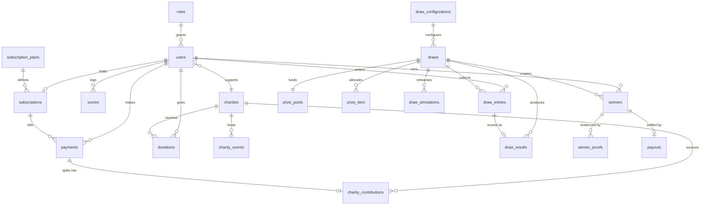
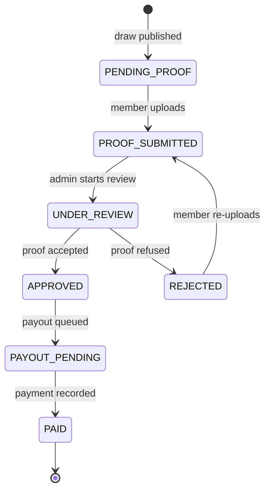

# Database schema

PostgreSQL 14+. One migration, `server/migrations/001_init.sql`, with a
matching `001_init.down.sql`. Run with `npm run migrate`, roll back with
`npm run migrate:down`, wipe and rebuild with `npm run db:reset`.

Conventions used throughout:

- **UUID primary keys** (`gen_random_uuid()`, via `pgcrypto`).
- **`citext` for email**, so addresses are case-insensitively unique.
- **Money as `INTEGER` minor units** (pence). Never `FLOAT`, never `MONEY`.
- **`TIMESTAMPTZ`** for every instant; `DATE` only where the time of day is
  genuinely meaningless (`scores.played_on`, `draws.period_month`).
- **`touch_updated_at` trigger** on tables carrying `updated_at`.
- Foreign keys use `ON DELETE CASCADE` for owned children and `ON DELETE
  RESTRICT` where the parent must not disappear from under financial records.

## Entity relationships

## Tables

### Identity

| Table | Purpose | Notable constraints |
| --- | --- | --- |
| `roles` | `subscriber`, `admin` | `UNIQUE (key)` |
| `users` | Accounts | `email citext UNIQUE`; `handicap BETWEEN -10 AND 54`; `charity_percent BETWEEN 10 AND 100`; `status IN ('active','suspended','deleted')` |

`users.charity_id` and `users.charity_percent` carry the member's standing
choice. The 10% floor lives here as a `CHECK`, which is why it cannot be
bypassed by any route, script or manual `UPDATE` that goes through the column.

### Giving

| Table | Purpose | Notable constraints |
| --- | --- | --- |
| `charities` | Directory | `slug UNIQUE`; partial indexes on `is_active` and `is_featured`; `impact_metrics JSONB` |
| `charity_events` | Fundraisers and golf days | indexed by `(charity_id, starts_at)` |
| `charity_contributions` | Charity share of each payment | `amount_minor >= 0`; indexed by charity and by user |
| `donations` | One-off gifts, independent of membership | `amount_minor >= 100`; `user_id` nullable so signed-out visitors can give |

Contributions and donations are kept apart deliberately: one is a derived split
of a subscription, the other is a standalone transaction. Reports add them
together for headline figures but can still separate them.

### Money

| Table | Purpose | Notable constraints |
| --- | --- | --- |
| `subscription_plans` | `monthly`, `yearly` | `prize_share NUMERIC(4,3)`; `amount_minor > 0` |
| `subscriptions` | One live membership per user | `uq_subscription_live` — partial `UNIQUE (user_id) WHERE status IN ('active','trialing','past_due')` |
| `payments` | Every charge, with its split | `charity_minor + prize_minor + platform_minor <= amount_minor` |
| `webhook_events` | Provider event ledger | `UNIQUE (provider, event_id)` — this is what makes webhook handling idempotent |

A replayed Stripe event hits the unique constraint on `webhook_events` and is
discarded before any financial row is written twice.

### Play

| Table | Purpose | Notable constraints |
| --- | --- | --- |
| `scores` | Stableford entries | `value BETWEEN 1 AND 45`; `uq_score_per_user_per_day UNIQUE (user_id, played_on)`; index on `(user_id, played_on DESC)` |

The five-retained rule is not a database constraint — it is an invariant the
score service holds inside a transaction that locks the member's rows with
`FOR UPDATE`, deletes the evicted ones and inserts the new one. A constraint
could enforce a count, but it could not choose *which* row to evict.

### The draw

| Table | Purpose | Notable constraints |
| --- | --- | --- |
| `draw_configurations` | Reusable draw settings | `uq_draw_config_default` — only one default |
| `draws` | One per month | `reference UNIQUE`; `status IN ('scheduled','open','locked','simulated','published')`; `winning_numbers INTEGER[]` |
| `prize_pools` | Computed pool per draw | `UNIQUE (draw_id)`; `total_minor = contribution_minor + carry_over_minor` |
| `prize_tiers` | 5/4/3 allocation | `uq_tier_per_draw UNIQUE (draw_id, match_count)`; `match_count BETWEEN 3 AND 5`; `share > 0 AND share <= 1` |
| `draw_entries` | One ticket per entitled member | `UNIQUE (draw_id, user_id)`; `numbers INTEGER[]` |
| `draw_results` | Per-entry outcome | `UNIQUE (entry_id)` |
| `draw_simulations` | Dry runs | `result JSONB`; nothing else references it |
| `winners` | A claim | `UNIQUE (draw_id, user_id, match_count)`; `state` and `payment_status` both constrained |

`draw_simulations` is intentionally a leaf table. Nothing reads from it except
the admin UI, so a simulation can never leak into member-visible state.

### Verification and payout

| Table | Purpose | Notable constraints |
| --- | --- | --- |
| `winner_proofs` | Uploaded screenshots | `uq_current_proof` — partial `UNIQUE (winner_id) WHERE is_current`; stores `storage_key`, `checksum`, never bytes |
| `payouts` | Settlement record | `UNIQUE (winner_id)`; `status IN ('pending','processing','paid','failed')` |
| `audit_logs` | Administrative actions | indexed by actor, by entity and by time |

A rejected proof is kept with `is_current = false` and a new upload becomes
current, so the history of a disputed claim survives.

## Winner state machine

The transition table lives in `server/src/domain/winners/winnerStateMachine.js`.
Any transition not in that table is rejected with a 409 regardless of who asks.

## Seed data

`npm run seed` loads a realistic dataset: one administrator, fifteen members
spread across active, past-due, cancelled and expired states, eight fictional
charities with impact metrics and events, payment and contribution ledgers,
Stableford histories, two published draws (the first rolling its jackpot into
the second), winners in every verification state, and one open draw ready to
simulate. Every seeded account shares the password `DigitalHeroes2026!`.
